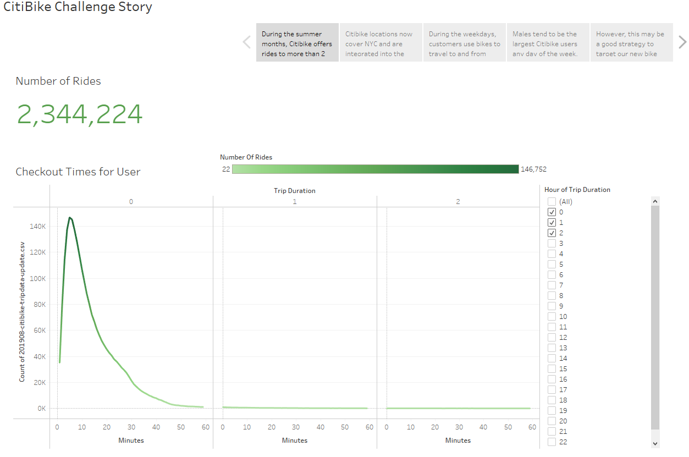
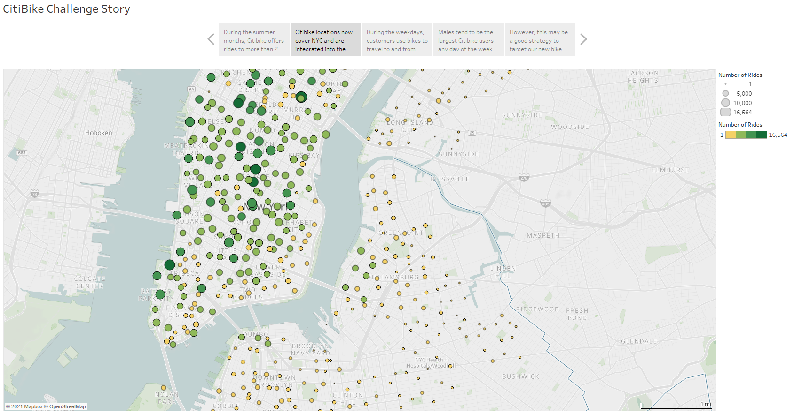
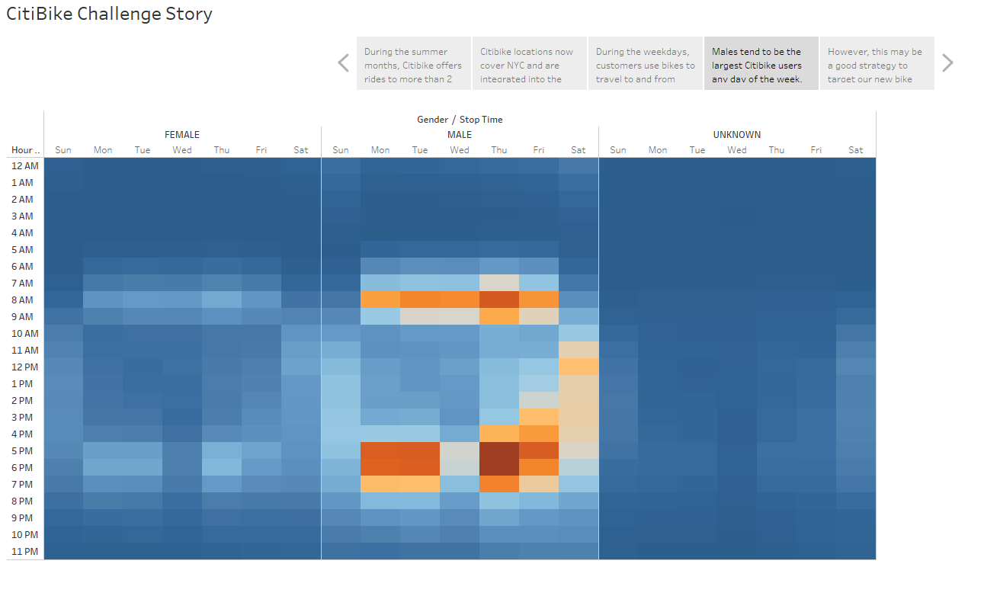
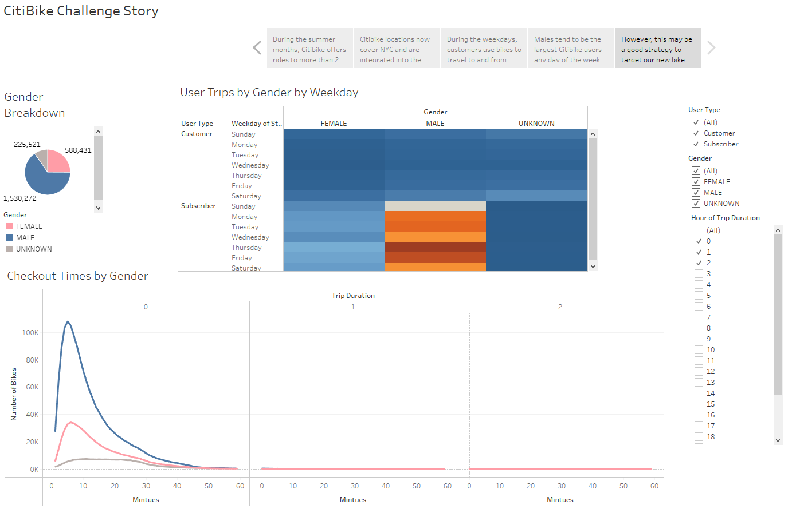

# Module 14: NY Citibike with Tableau
## Resources

- **Data Sources:** 
  - From CitiBike Website: [201908-citibike-tripdata.csv](https://s3.amazonaws.com/tripdata/index.html)
- **Software:** Tableau, Python, Pandas, JupyterLab

## Challenge Project Overview 

Using Tableau, a data visualization software, I assisted CitiBikes, a bike-sharing company, in presenting a business proposal to launch CitiBikes in other cities. Their business proposal aims to use the successes of New York City's CityBike program to convince other cities to adopt using CitiBikes.  

First, I imported data into Tableau using data from the CitiBike website to build our dashboards. Next, I created and styled worksheets, dashboards, and stories to visualize the data so that CitiBikes could tell the story of their data during the presentation. After reconfirming the data was accurate, it was finally time to display our visualized data for their business proposal. 

## Challange Project Analysis

Visit My Tableau Story: [CitiBike Challenge Story](https://public.tableau.com/app/profile/daniel.brock8416/viz/Tableau_NY_Citibike_Challenge/CitiBikeChallengeStory?publish=yes)

Story:
  1) During the summer months, Citibike offers rides to more than 2 million customers. Most bike rides range from 2 to 20 minutes.
     
  2) Citibike locations now cover NYC and are integrated into the city as a transportations alternative.
     
  3) During the weekdays, customers use bikes to travel to and from work, which is indicated by the peak hours. On the weekends, bikes usage increases during the afternoons, telling us our bikes are now part of users' weekend activities.
     
  4) Males tend to be the largest Citibike users any day of the week.
     
  5) However, this may be a good strategy to target our new bike locations around popular male attractions or gathering spots.
     
 
 ## Challange Project Summary
 From our visualizations, we can observe that during weekdays bike usage is most active around mid-morning and late afternoons, meaning our rides are using CitiBikes as a commuting alternative. Males dominate the usage of Citibikes. 

Two visualizations I would like to see for expanding into new locations:
1) A map showing the ride usage dotted around the city. And additional dots pointing out popular male attractions such as sports bars, recreational facilities, etc. This way we could see if there was a correlation of the success of that location based on gender. 
2) Another map dotting the city with sized trip duration markers. I would then layer in a map of subway and bus routes to see if longer trip durations are due to lack of public transit access.
 
